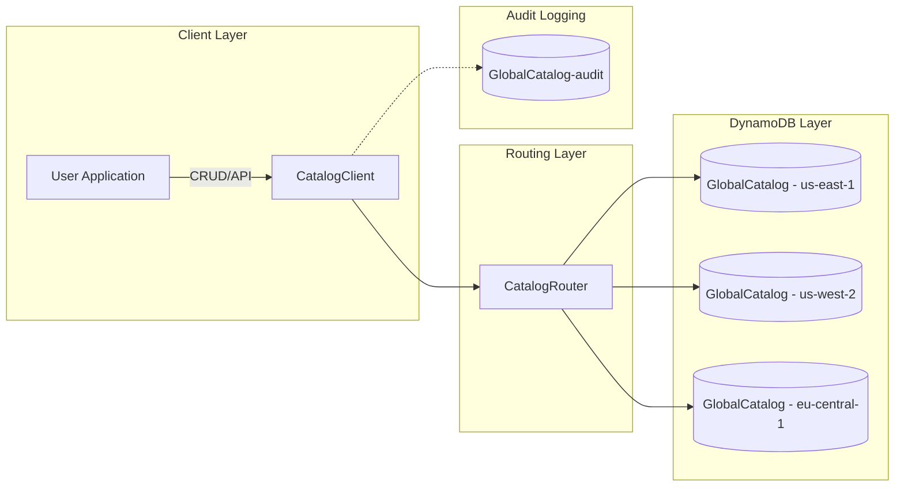

# GlobalScale Multi-Region Catalog

A fully automated, globally distributed product catalog service using AWS DynamoDB Global Tables, Terraform, and a Python client library with built-in versioning, audit logging, and fail-over routing.

---

## Table of Contents

1. [Overview](#overview)  
2. [Features](#features)  
3. [Architecture](#architecture)  
4. [Directory Layout](#directory-layout)  
5. [Prerequisites](#prerequisites)  
6. [Getting Started](#getting-started)  
   - [1. Infrastructure Provisioning](#1-infrastructure-provisioning)  
   - [2. Python Client Setup](#2-python-client-setup)  
   - [3. Running Smoke Tests](#3-running-smoke-tests)  
7. [Testing & CI/CD](#testing--cicd)  
8. [Benchmarking](#benchmarking)  
9. [Monitoring & Alerts](#monitoring--alerts)  
10. [Documentation](#documentation)  
11. [Next Steps](#next-steps)  

---

## Overview

This project implements a **global, low-latency, and highly available** catalog microservice using:

- **Terraform** to provision a DynamoDB Global Table (with replicas in multiple regions) and an audit-log table  
- A **Python client** (`CatalogClient`) for CRUD operations, version-based conflict resolution, region-prefixed keys, audit logging, and automatic fail-over  
- **GitHub Actions** CI to run `pytest`/`moto` integration tests and optional benchmarks on each push  
- **CloudWatch** alarms for read/write capacity spikes  
- **Mermaid** diagrams documenting the system architecture and ER model  

---

## Features

- **Global DynamoDB Table**: Multi-region replicas with on-table Streams enabled for change data capture  
- **Audit Logging**: Every write emits an audit event into a separate, globally replicated `GlobalCatalog-audit` table  
- **Versioning & Conflict Resolution**: Implements last-writer-wins via an incrementing `Version` attribute  
- **Fail-Over Routing**: `CatalogRouter` attempts a primary region first, then falls back to a healthy secondary  
- **CI/CD Pipeline**: Automated tests and benchmarks via GitHub Actions  
- **Monitoring**: CloudWatch alarms for consumed read/write capacity thresholds  
- **Documentation**: Mermaid diagrams for system architecture and ER design  

---

## Architecture

<details>
<summary>Click to expand the Mermaid flowchart</summary>


</details>

---

## Directory Layout

```
global-catalog/
├── README.md
├── docs/
│   └── diagrams/
│       ├── architecture.md
│       └── er_diagram.md
├── infrastructure/
│   └── terraform/
│       ├── main.tf
│       ├── audit_log.tf
│       ├── monitoring.tf
│       ├── variables.tf
│       └── outputs.tf
├── src/
│   └── python-client/
│       ├── client.py
│       ├── router.py
│       ├── requirements.txt
│       └── tests/
│           └── test_client.py
├── benchmark/
│   ├── benchmark.py
│   └── README.md
└── .github/
    └── workflows/
        └── ci.yml
```

---

## Prerequisites

- **AWS CLI** configured with credentials  
- **Terraform** v1.x  
- **Python** 3.10+ and `virtualenv`  
- **Git**  

---

## Getting Started

### 1. Infrastructure Provisioning

```bash
cd infrastructure/terraform
terraform init
terraform apply -auto-approve
```

This will create:

- `GlobalCatalog` DynamoDB Global Table with replicas in your configured regions  
- `GlobalCatalog-audit` audit-log table with on-table Streams  
- CloudWatch alarms for read/write capacity usage  

---

### 2. Python Client Setup

```bash
cd src/python-client
python3 -m venv .venv
source .venv/bin/activate
pip install -r requirements.txt
```

Set environment variables:

```bash
export AWS_REGION=us-east-1
export DDB_TABLE=GlobalCatalog
export DDB_REGIONS=us-east-1,us-west-2,eu-central-1
```

---

### 3. Running Smoke Tests

```bash
cd src/python-client
python client.py
```

Expected output:

```
Using table in region: us-east-1
Putting test item…
Fetching test item… {'ItemID':'test123','Category':'Demo','Version':1,'Name':'Example'}
Audit log entry created.
```

---

## Testing & CI/CD

- **Run Tests**:

  ```bash
  cd src/python-client
  pytest
  ```

- **GitHub Actions**: `.github/workflows/ci.yml` runs on every push to:

  - Install dependencies  
  - Run `pytest`  
  - Optionally run `benchmark.py` if AWS credentials are set as secrets  

---

## Benchmarking

```bash
cd benchmark
python3 -m venv .venv-bench
source .venv-bench/bin/activate
pip install boto3
python benchmark/benchmark.py
```

Reports:

- **Put throughput (ops/sec)**  
- **Query throughput**  

---

## Monitoring & Alerts

CloudWatch alarms (via Terraform):

- **HighWriteUsage**: alerts when write capacity spikes  
- **HighReadUsage**: alerts when read capacity spikes  

Integrate with SNS, Slack, or other channels as needed.

---

## Documentation

- **Architecture Diagram**: `docs/diagrams/architecture.md`  
- **ER Diagram**: `docs/diagrams/er_diagram.md`  

Render Mermaid diagrams on GitHub or with a Mermaid live editor.

---

## Next Steps

- **Load Testing**: Use k6 or JMeter to validate latency SLAs (p50/p95)  
- **Dockerization**: Containerize the client and push to ECR  
- **API Layer**: Build REST endpoints with AWS Lambda & API Gateway  
- **PyPI Packaging**: Publish `CatalogClient` library  
- **Grafana Dashboards**: Visualize real-time metrics and alarms
